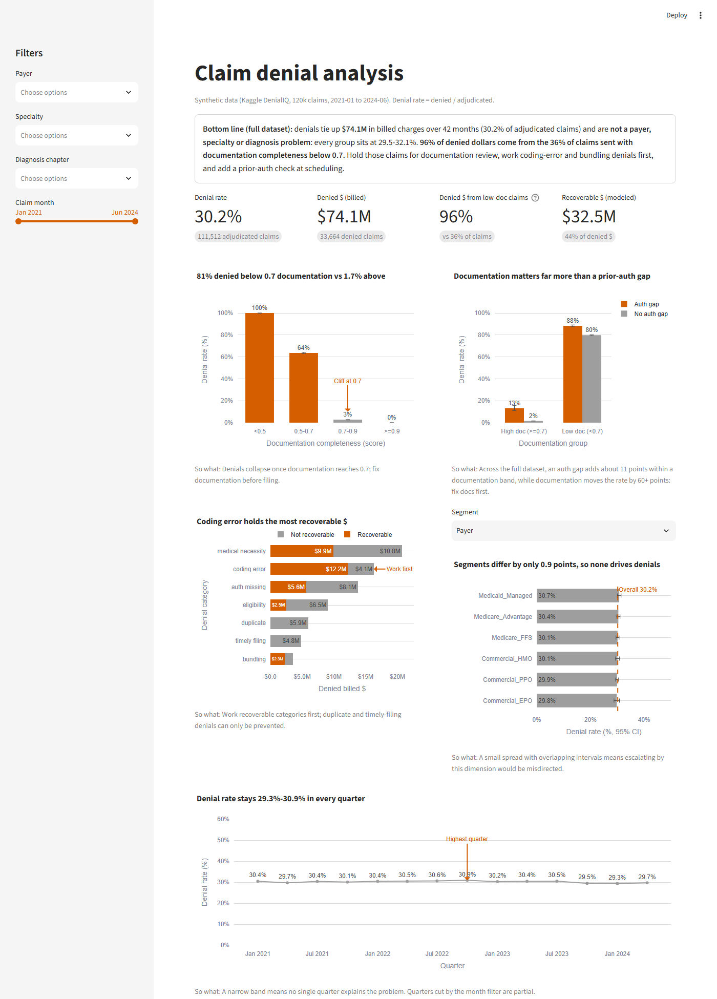
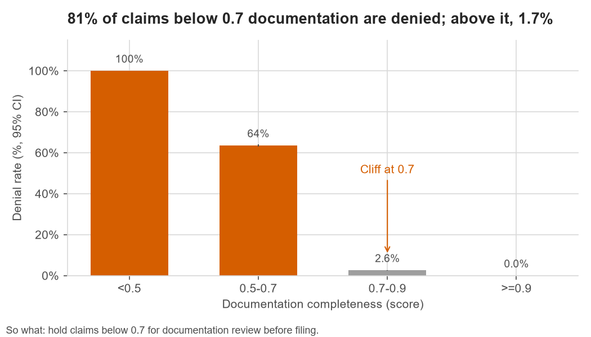
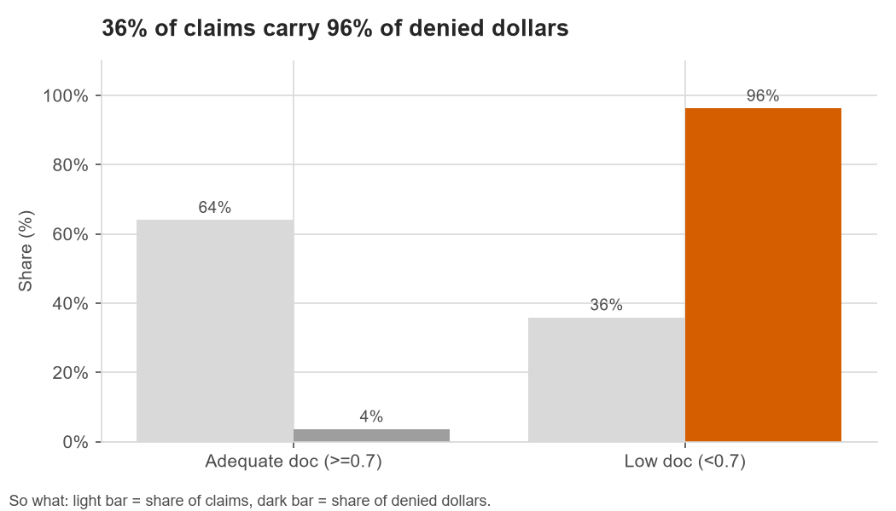
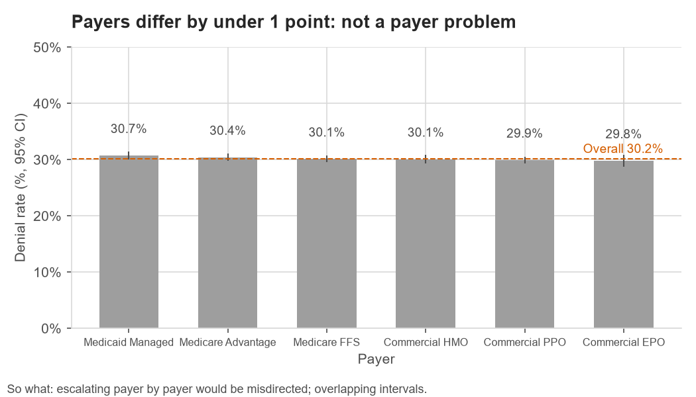
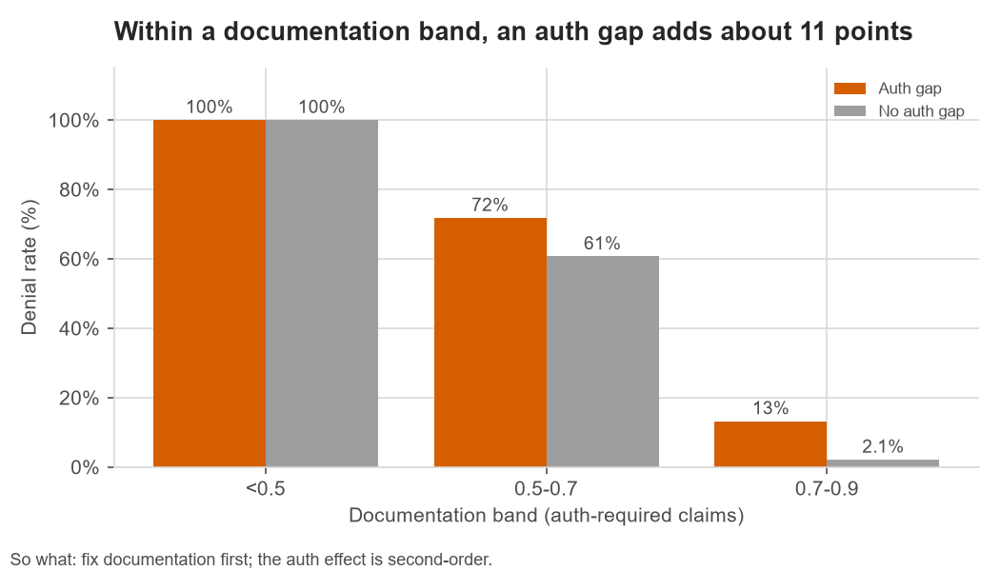
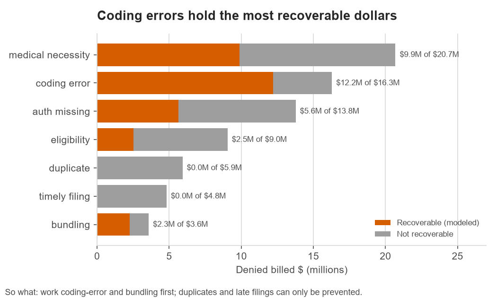
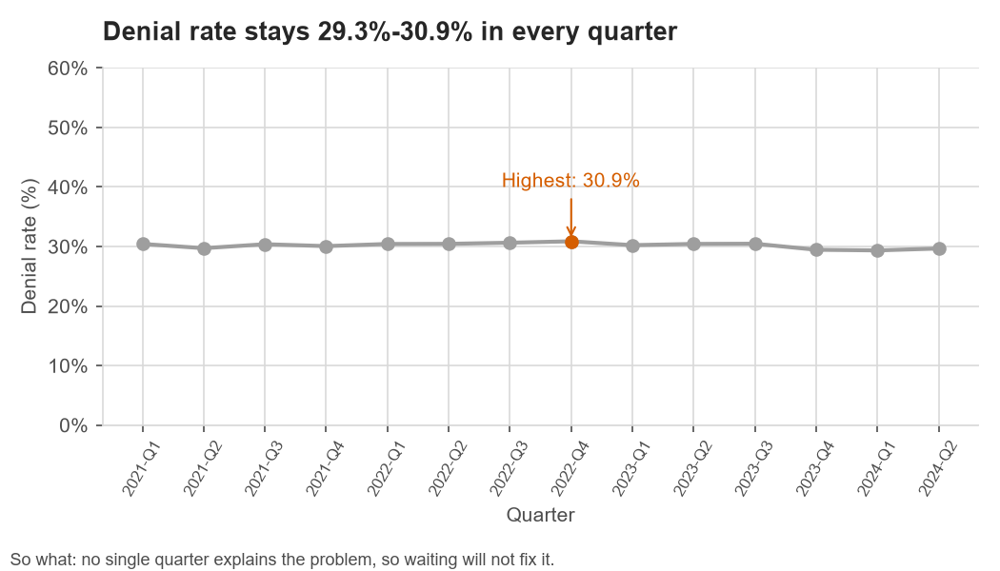

# Claim Denial Analysis

**Question:** Which procedures, providers, payers and diagnosis categories get denied most, what do denials cost, and what should a billing team do about it?

**Data:** 120,000 claims from the Kaggle dataset [DenialIQ: 120K Medical Claims | X12 Denial Codes](https://www.kaggle.com/datasets/nudratabbas/denialiq-120k-medical-claims-x12-denial-codes) (CC BY-SA 4.0), submitted January 2021 to June 2024. **The dataset is synthetic** (every row is flagged `synthetic_flag = TRUE` by its author). Findings show how this analysis would run on real 837/835 data; the specific numbers describe the generator, not a real hospital.

## Dashboard preview



```bash
pip install -r requirements.txt && streamlit run app.py
```

---

## 1. Bottom line

Denials tie up **$74.1M in billed charges** over 42 months (30.2% of adjudicated claims), and they are **not a payer or specialty problem**: every payer, specialty and diagnosis group is denied at 29.5–32.1%. **96% of denied dollars come from the 36% of claims sent with documentation completeness below 0.7**, which are denied 81% of the time versus 1.7% for everything else. Hold claims below 0.7 for documentation review before they go out. If documentation actually drives the outcome (see the caveat below) and a quarter to half of held claims can be fixed, that is worth up to **$5–10M a year** in billed charges kept out of denial. A one-specialty pilot should confirm this before rollout.

> **Caveat on the headline:** in this dataset, every claim below 0.5 documentation is denied and none at 0.9 or above is. That pattern is too clean for real payer behaviour. It looks like a rule built into the synthetic generator, or a score recorded after the denial. In either case the dollar figure is an upper bound.

## 2. Key findings

1. **Low documentation accounts for almost all denials.** Claims scoring below 0.7 are denied 81.1% of the time, against 1.7% for claims at 0.7 or above. The low-documentation group is 36% of claims but 96% of denied dollars ($71.4M of $74.1M). Below 0.5, all 19,233 claims were denied, which looks like a hard rule in the synthetic generator rather than real payer behaviour.




2. **Payer, specialty and diagnosis barely matter, so a payer-by-payer escalation would be misdirected.** The six payers sit between 29.8% and 30.7% with overlapping confidence intervals. None of the three dimensions is significantly related to denial: chi-square p = 0.48 for payer, 0.88 for specialty and 0.13 for diagnosis chapter, and every Cramér's V is 0.013 or less, which is effectively zero. Adjusting for procedure mix moves no payer or specialty more than 2% from its expected rate, so the flat picture is not a Simpson's-paradox artefact. Orthopedic surgery (31.6% of denied dollars) and CPT 27447, total knee replacement (19.1%), lead on dollars only because they bill the most per claim ($8,118 average for orthopedics, against $5,034 for OB/GYN and $3,789 for cardiology). Their denial rates of 29.6% and 29.0% are at the average.


3. **Prior-auth gaps look like a major driver, but most of that is a documentation effect.** The raw comparison is 79.4% denied with an auth gap versus 22.6% without. However, 88% of gap claims also have weak documentation. Comparing gap and no-gap claims within the same documentation band (auth-required claims only), a gap adds about 11 points in the 0.5–0.7 band (71.8% vs 60.7%) and in the 0.7–0.9 band (13.2% vs 2.1%). Below 0.5 it adds nothing, because every claim there is denied anyway. That works out to about 102 extra denials and $0.38M a year: real, but second-order.


4. **$32.5M of denied charges is modeled as recoverable, and it is concentrated.** Coding-error and bundling denials have the best appeal odds (74% and 62% average modeled success) and hold $14.5M recoverable, about $4.1M a year. Duplicate and timely-filing denials ($10.7M, about $3.1M a year) are not appealable at all. They can only be prevented, not worked.


5. **The problem is structural, not getting better or worse.** The quarterly denial rate has stayed between 29.3% and 30.9% for 14 straight quarters. No single period explains it, so waiting will not fix it.



## 3. Recommendations (ranked by impact vs. effort)

| # | Action | Owner | Expected impact (assumptions) | How to measure |
|---|---|---|---|---|
| 1 | **Pre-submission documentation hold.** A claim-scrubber rule holds any claim scoring below 0.7 for clinical documentation review before it is filed. Start with orthopedics and OB/GYN, which bill the most per claim. | Revenue Cycle Director, with the CDI (clinical documentation) lead | **Up to $5.0M–$10.0M a year** in billed charges kept out of denial. This assumes documentation drives the outcome, that 25–50% of held claims can be brought to 0.7+ before the filing deadline, and that fixed claims then deny like today's 0.7+ claims (1.7%). Medium effort. | Share of claims submitted below 0.7 (36% today); denial rate on held-then-released claims; monthly denied dollars |
| 2 | **Recode-and-resubmit queue, sorted by recoverable dollars.** Work coding-error and bundling denials first. Stop spending appeal time on duplicate and timely-filing denials and fix them with submission edits instead. | Denials / AR supervisor | **$2.1M–$4.1M a year** recovered. This takes the dataset's modeled $4.1M a year and assumes 50–100% of it is realized. Low effort. | Recovered dollars by denial category; days from denial to resubmission; appeal win rate against the modeled rate |
| 3 | **Prior-auth check at scheduling** for CPT codes that require it, so no service goes ahead with an auth gap. | Patient Access Manager | **About $0.38M a year** in denied charges (about 102 claims), measured inside each documentation band so the documentation effect is not double-counted. Medium effort, so do it after #1. | Auth-gap rate on auth-required claims (13% today: 6,686 of 50,324); denial rate on those claims |

All dollar figures are billed charges, not expected cash. Real collections on these claims would be a fraction of billed, so treat the ranges as an upper bound on cash impact.

## 4. Method and rigor

- **Pipeline:** `clean.py` (runs `sql/00_clean.sql`) → `analyze.py` (runs `sql/01`–`11`, writes `outputs/*.csv`) → `app.py` (Streamlit dashboard). SQL runs in DuckDB, and every number in this README comes from a file in `outputs/`.
- **Cleaning:** every check and its row count is in [DATA_QUALITY.md](DATA_QUALITY.md). No rows were dropped: there were zero duplicates, zero non-positive amounts and zero out-of-range dates. Denial labels joined 1:1 onto the 33,664 denied claims. Three single-value columns were removed.
- **Definitions:**
  - *Denial rate* = denied ÷ adjudicated. The 8,488 pending claims are excluded from the denominator. Partial pays count as not denied.
  - *Denied $* = billed `claim_amount_usd` on denied claims.
  - *Recoverable $* = the dataset's `estimated_recovery_usd`, a modeled value.
  - *Low documentation* = `documentation_completeness` below 0.7.
  - *Provider* = provider specialty, because the data has no individual provider IDs.
  - *Diagnosis category* = ICD-10 chapter, taken from the first letter of the primary diagnosis.
- **Uncertainty:** every segment rate in `outputs/` carries a 95% Wilson confidence interval. Independence of denial from payer, specialty and diagnosis chapter was tested with chi-square (`outputs/stats.csv`). Cramér's V is reported because at n = 111,512 even trivial gaps can reach significance.
- **Simpson's paradox checks:**
  - `09_mix_adjusted.sql` compares each payer's and specialty's observed rate with the rate its CPT mix would predict (indirect standardization). It also compares payers against their documentation and auth-gap mix. All ratios fall between 0.985 and 1.018.
  - `10_doc_auth_matrix.sql` splits the auth-gap effect by documentation band, using auth-required claims only. That split is what shrank the apparent auth effect in finding 3.
- **Impact sizing:** `sql/11_impact_scenarios.sql` holds the scenario logic. Annual figures divide 42-month totals by 3.5.

## 5. Limitations and risks

- **Synthetic data.** The 100% denial rate below 0.5 documentation and the flat rates across payers are almost certainly properties of the generator. Real payers differ in denial behaviour, and real data would need this analysis rerun before any action.
- **Correlation, not causation.** The documentation finding is an association. Claims with poor documentation may also differ in ways that are not recorded, such as rushed encounters or particular clinicians. Recommendation 1 assumes that improving documentation changes the outcome, and that should be proven with a pilot.
- **Timing of the documentation score.** If `documentation_completeness` is measured after adjudication (for example, by an auditor reviewing denied claims), it partly reflects the outcome and would overstate the effect. The data dictionary does not say when it is scored.
- **Billed vs. paid.** Dollar impacts use billed charges. Expected reimbursement is not in the data.
- **Modeled recovery.** `estimated_recovery_usd` and appeal probabilities come from the dataset author's model, not from observed appeal outcomes.
- **Incomplete 2024.** 2024 covers only January to June, so trends are compared by quarter, never by full year.
- **Inconsistent categories.** Even "duplicate" and "timely filing" denials are over 93% low-documentation (`outputs/06_by_denial_category.csv`), which would not happen in real data. The category and driver results should not be combined into one causal story.

## 6. Next steps

1. Rerun the pipeline on real remittance (835) and claim (837) data, and add allowed and paid amounts so impact is in cash.
2. Pilot the documentation hold on one specialty for 8–12 weeks against a comparable control specialty, and compare denial rate and days in A/R.
3. Confirm when the documentation score is produced. If it is post-adjudication, rebuild the driver analysis on fields known at submission.
4. Track actual appeal outcomes so recovery estimates are observed, not modeled.

---

## Run it

```bash
python -m venv .venv && .venv/Scripts/activate        # Windows; use .venv/bin/activate on macOS/Linux
pip install -r requirements.txt
# Raw data (not committed; needs a Kaggle API token in ~/.kaggle/kaggle.json):
python -m kaggle datasets download nudratabbas/denialiq-120k-medical-claims-x12-denial-codes -p data/raw --unzip
python clean.py      # -> data/clean/claims.parquet, DATA_QUALITY.md
python analyze.py    # -> outputs/*.csv
streamlit run app.py
```

The cleaned parquet file is committed, so `streamlit run app.py` works straight after cloning, without the download.

**Dashboard:** a bottom-line box, four KPI cards and five charts: denial rate by documentation band; auth gap vs documentation; denied $ by category, split into recoverable and not; denial rate by payer, specialty or diagnosis chapter; and the quarterly trend. Filters cover payer, specialty, diagnosis chapter and month range.

| Path | What it is |
|---|---|
| `clean.py`, `sql/00_clean.sql` | Cleaning and data-quality log |
| `sql/01`–`11_*.sql` | One commented query per question |
| `analyze.py` | Runs the queries and the chi-square tests, writes `outputs/` |
| `app.py`, `.streamlit/config.toml` | Streamlit dashboard and theme |
| `make_figures.py`, `assets/` | Static README charts (matplotlib, from `outputs/`) and dashboard screenshot |
| `outputs/` | Query results that back every number above |

## License

Code: MIT (see `LICENSE`). Data: the committed `data/clean/claims.parquet` is derived from the DenialIQ dataset by Kaggle user nudratabbas, licensed CC BY-SA 4.0, and is shared under the same license.
